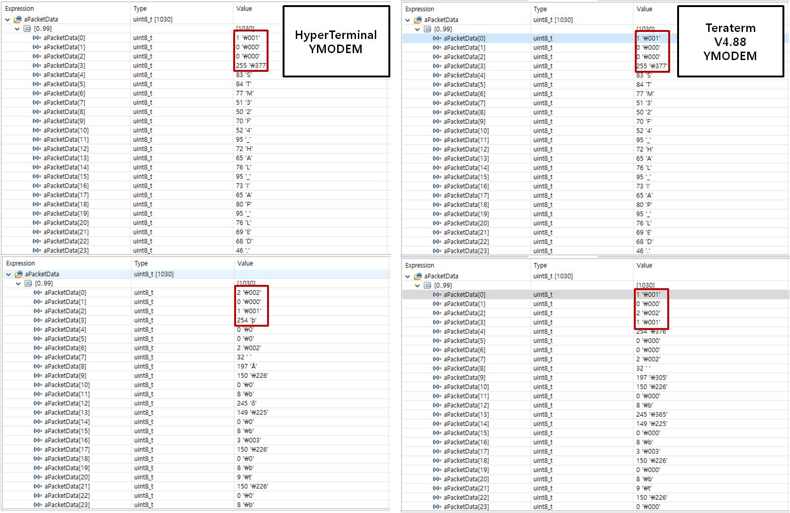

# STM32F4_HAL_IAP_UART
UART IAP Example for STM32F4

I've downloaded the IAP example from the ST home page. 
https://www.st.com/en/embedded-software/x-cube-iap-usart.html  

I've modified the STM3210C_EVAL project to port IAP example for STM32F407.  
1) Modified flash_if.h and flash_if.c for STM32F407 flash memory.
2) Modified ymodem.c to support Teraterm over v4.85. 
  Behavior of YMODEM is different between v4.85 and v4.86.  

I've attached the debugging images of HyperTerminal and Teraterm v4.88  
Teraterm v4.88 sends unexpected SOH packet. so I had to add some code to ignore unexpected SOH packet.  

 

  

